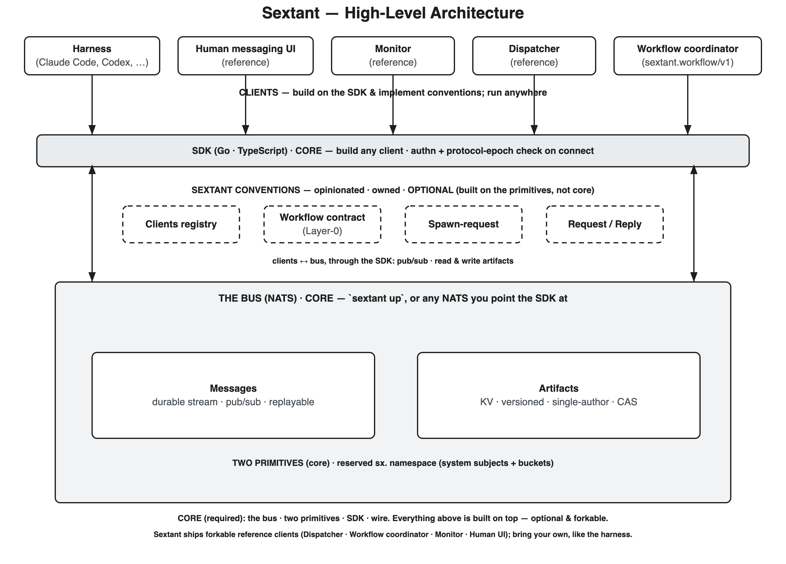

# High-level architecture

The map the rest of the canon hangs off. Each decision ADR (0004+) names the
component(s) it touches; this is where those names live.

**Core (required)** — the minimal thing Sextant *is*: the **bus** + the **two
primitives** + the **wire/protocol** + the **SDK**.

- **The bus (NATS)** — the substrate. Run it as one binary (`sextant up`,
  embedded NATS) or point the SDK at any NATS you already run. It carries the
  two primitives and reserves the `sx.` namespace for system subjects and
  buckets.
- **Two primitives** — **Messages** (durable stream · pub/sub · replayable) and
  **Artifacts** (KV · versioned · single-author · CAS). The *only* things the
  bus provides.
- **SDK (Go · TS)** — how a client is built. It connects, authenticates, and
  checks the protocol epoch on connect.

**Sextant conventions (opinionated · owned · optional — not core)** — patterns
built *on* the primitives, the same way your own clients build them. Sextant
authors and ships these as forkable, but nothing requires them: the **Clients
registry**, the **Workflow contract** (Layer-0), **Spawn-request**, and
**Request/Reply**. A new backend implements the two primitives; the conventions
ride on top.

- Each convention is a thin **contract** (addressing + a lexicon + rules) that
  makes interop possible. Most also have a forkable **reference client** that
  implements it — the **Workflow contract (Layer-0)** is realized by the
  **Workflow coordinator** (`sextant.workflow/v1`); **Spawn-request** by the
  reference **Dispatcher**. *Minimal contract vs. opinionated implementation* is
  exactly the convention-vs-client split.

**Clients** — every running thing is a *client*: a process that speaks the
protocol and builds on the SDK. A harness (Claude Code, Codex), a human
messaging UI, a monitor, a dispatcher, a workflow coordinator — all the same
kind of thing, differing only in what they do. Clients run anywhere, and **they
implement conventions: fork Sextant's, or write your own.** Sextant ships
forkable reference clients; the harness is an example of one you bring yourself.

The editable diagram source is `assets/architecture.excalidraw`; regenerate the
PNG with `assets/gen-arch.mjs` (it emits both the `.excalidraw` and the `.svg`).

Component-level decisions — why two primitives, why no daemon, the wire atom,
lifecycle, workflows, the `sx` namespace, multi-backend — live in ADRs 0004+
and reference this map.
