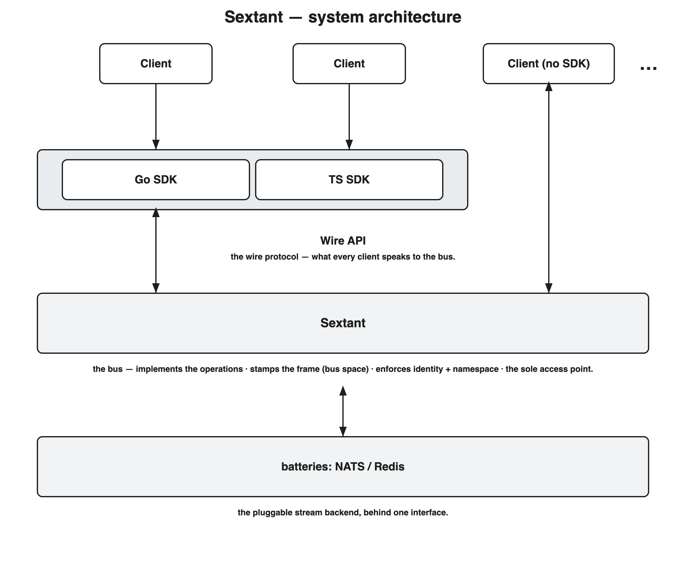

# The bus implements the protocol over a pluggable stream backend

Sextant is **the bus**: a single process that *implements* the protocol's operations
— publish, read, subscribe, the artifact operations, the clients registry — and
stamps the data Sextant owns, backed by a **stream backend it calls into through
one internal interface**. NATS is the first backend (embedded by `sextant up`, or
hosted); a second (e.g. Redis) is a different module behind the same interface.

This refines ADR-0007: the bus is no longer "NATS that the SDK talks to
directly." NATS is an implementation detail behind a module; clients talk to
**Sextant**.

## The invariant

**Swapping the backend does not change the protocol.** The operations, the frame,
and the lexicons are identical whether the backend is embedded NATS, hosted NATS,
or Redis. What we protect is the portability of the *protocol*, not compatibility
with any particular NATS deployment. (This replaces ADR-0007's "client-first,
works against any NATS" — that was never the goal; backend-swappability of the
API was.)

## The shape

*Editable source: `assets/0018-architecture.excalidraw` (regenerate the PNG/SVG
with `assets/gen-0018-arch.mjs`).*

Everything a client touches is the wire protocol; everything below Sextant is
backend-specific and hidden behind the interface. Clients never reach the backend.

## The bus owns access

The dividing line: **the record is user space; the frame is bus space.** The
client supplies the record; the **bus** produces the frame around it — the
`id`, `kind`, `epoch`, and the fields only the bus can be trusted to set: the
`revision`, the timestamps, and the **`author`**, taken from the request's
authenticated identity. That closes the forgeable-sender gap — identity is
bus-enforced, not client-asserted, so it holds even outside the trusted-agent
assumption.

**Nothing is direct.** All access — reads, writes, and subscriptions — is served
by the bus; a client never addresses the backend itself. A direct read would leak
the backend and break the invariant, so the bus is the sole access point.

Two consequences follow: the operation transport becomes a **synchronous call over
the Wire API** — a client *calls* an operation on the bus and gets its result back
(the stamped frame, or the error). This is **not** client↔client request/reply
(TASK-23) — that is one client asking another, and it stays its own messaging
convention. And the **Wire API — not any single SDK — is the boundary**: clients
reach the bus over the wire protocol, and the Go and TS SDKs are conveniences over
it.

## The semantic contract is the backend interface

The behaviour any backend must provide — a durable, ordered, replayable log;
compare-and-set on version; get; watch; key enumeration; and the identity
binding — stops being prose for hypothetical bring-your-own clients and **becomes
the interface the backend module satisfies**. The operation logic is written once
against it; each backend (NATS now, Redis later) implements it. `nats-binding.md`
becomes the NATS module's implementation notes, not "how a client speaks NATS."

## What this is not

Not a return of the control plane. The bus implements storage and messaging
operations and stamps records; it does **not** supervise, reconcile, restart, or spawn
anything. It remains the one long-lived process ADR-0007 always allowed — now a
real protocol server rather than a passthrough.

## The discipline

Extracting the backend interface against a single implementation risks encoding
NATS's shape under a neutral name — the exact trap ADR-0013 warns about. We
extract it anyway (the architecture needs the seam now), but bound the risk: the
interface is defined to the **semantic-contract primitives**, and every method is
checked against "how would Redis satisfy this?" before it is fixed — so the seam
is shaped by the protocol, not by NATS's API.

## Why

This was the intended model; the drift was framing Sextant as a thin SDK over
NATS. Making the bus implement the protocol over a backend module is what makes
the protocol genuinely backend-portable, lets the bus stamp Sextant-owned data
and enforce authorship in-process (it embeds the backend — no separate daemon
needed), and gives ADR-0017's thesis — the protocol surface, not the SDK, is the
source of truth — its literal meaning: the bus implements that surface.

Map (ADR-0003): refines the high-level architecture — the bus is a protocol
server over a pluggable backend; the SDK is a client of it. Supersedes ADR-0007's
"any NATS / client-first" framing; elevates ADR-0013 rule 1 (no backend type
leaks the API) to the central invariant and overtakes its "no interface yet"
guidance; reinforces ADR-0017. (Client↔client request/reply — TASK-23 — is a
separate messaging concern, not the client↔bus call transport this ADR introduces.)
